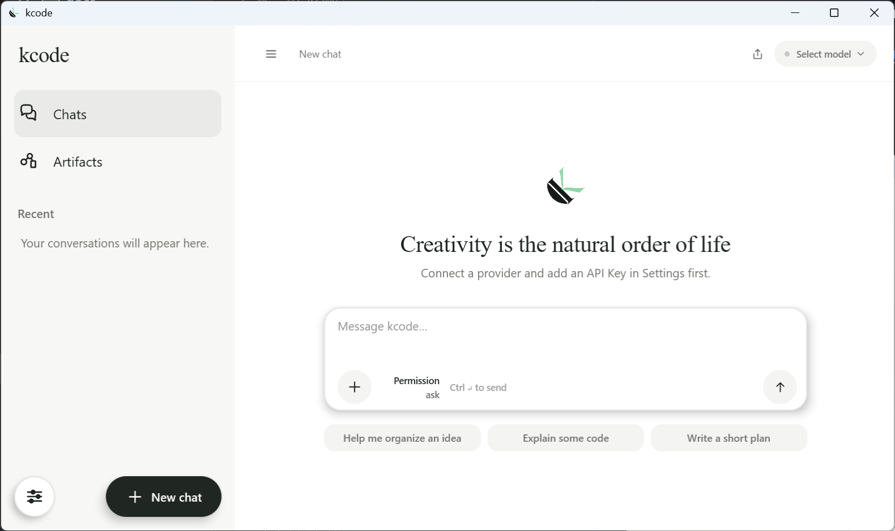
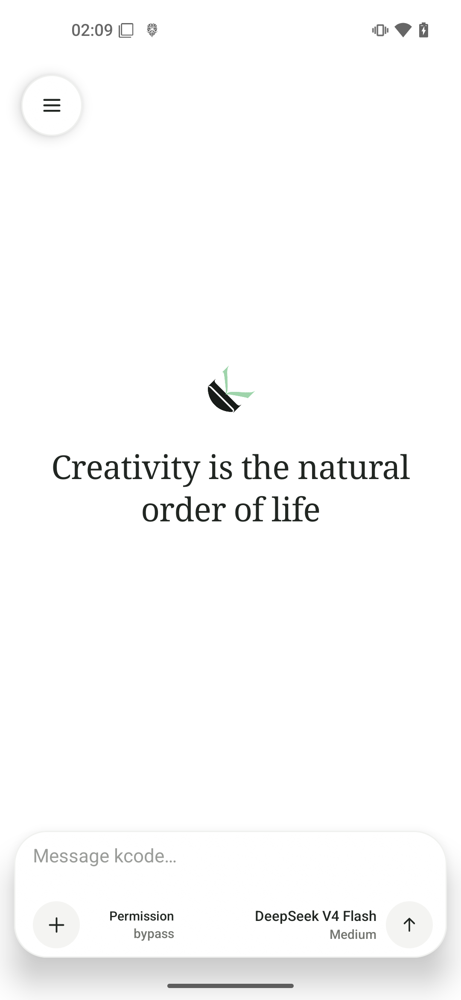

<div align="center">
  
  <h1>kcode</h1>
  <p><strong>An elegant, full-featured, cross-platform native AI agent.</strong></p>
  <p>One adaptive Compose UI. One capable agent runtime. Your models, tools, skills, and data.</p>

  <p>
    <strong>English</strong> · <a href="docs/README.zh-CN.md">简体中文</a>
  </p>

  <p>
    
    
    
    <a href="LICENSE"></a>
  </p>
</div>

> [!IMPORTANT]
> kcode is evolving quickly. Expect breaking changes, verify important agent actions, and read the security model before enabling privileged tools.

## The idea

kcode is an open-source native AI agent for Android, iOS, desktop, Web, and HarmonyOS. It is built around a simple belief: an agent should feel like a thoughtfully designed application—not a terminal transplanted into a chat box, and not a thin web wrapper duplicated for every device.

The project combines an adaptive [Compose Multiplatform](https://www.jetbrains.com/compose-multiplatform/) interface with a [Koog](https://docs.koog.ai/)-powered runtime, local-first persistence, real tools, reusable Skills, persistent Goals, scheduled automation, multi-agent orchestration, and runnable Web Artifacts. The same conversation can therefore move naturally from an answer, to tool-backed work, to a longer autonomous objective, to a recurring task, or to a small application you can open and use.

<table>
  <tr>
    <td align="center" width="76%">
      
      <br />
      <sub>Desktop</sub>
    </td>
    <td align="center" width="24%">
      
      <br />
      <sub>Android</sub>
    </td>
  </tr>
</table>

## What it can do

### Work as an agent, not only a chatbot

- Stream rich Markdown while preserving assistant responses and tool-call history in the conversation.
- Expose tool progress and results in place, with stop, regenerate, message selection, and rendered conversation export on supported platforms.
- Keep generation alive when the UI moves into the background on supported mobile hosts. Android can also show the live conversation and tool activity in a movable system overlay after the app leaves the foreground.
- Search the current Web through Google, Exa, or Bright Data and return source links.
- Read, list, write, and patch workspace files; read media where the platform implementation supports it.
- Run shell commands inside the desktop workspace. Android provides both its native `/system/bin/sh` environment and a complete Ubuntu 24.04 ARM64 user space, each using the selected app UID, Shizuku/ADB-shell, or real root identity.
- Route capability-bearing tools through a global `Deny`, `Ask`, or `Bypass` permission policy; internal coordination and Goal bookkeeping remain automatic.

### Plan and finish longer work

**Goals** turn a conversation into a persistent objective. A Goal survives app restarts, tracks status, elapsed time, and optional token budget, and can continue across agent turns until it is completed or genuinely blocked. Create one with `/goal <objective>`, then pause, resume, edit, or clear it from the conversation. Active Goals are surfaced above the composer; completed Goals leave the UI automatically.

**Multi-agent orchestration** lets the root agent delegate concrete subtasks, exchange messages, interrupt or reuse workers, and wait for their results before producing the final response. kcode supports five concurrent agents including the root coordinator. Running workers appear above the composer in a live two-column status area; selecting one opens its activity and output.

### Schedule one-shot and recurring work

When explicitly requested, the agent can create, list, pause, resume, and cancel scheduled prompts for the current conversation. A task can run once after a delay or at an absolute time, or repeat on an interval of at least one minute. Each run executes as a separate standalone conversation, presents its selected result in a floating card, and can be promoted into normal history or discarded. Android, iOS, desktop, and Web use the same persisted task model and can surface a platform notification, when permission and platform support allow it, after a result finishes in the background.

Scheduling is process-based rather than an operating-system alarm service: tasks run while the kcode process is available. Persisted overdue tasks are recovered after the app starts again, and recurring schedules skip missed intervals instead of launching overlapping catch-up runs.

### Extend behavior with Skills

kcode discovers `SKILL.md` packages from `/workspace/.agents/skills` and `/workspace/.kcode/skills`, then injects only the relevant instructions for the current request. Skills can describe domain knowledge, repeatable workflows, and tool usage without bloating the permanent system prompt. The runtime validates package boundaries and supports additional Skill providers through its authority-based provider model.

A built-in `kcode-web-app-builder` Skill drives the complete Web application loop: implement a responsive app, open it in the real container, inspect and interact with the rendered UI, collect console output and screenshots, fix defects, and—only after explicit confirmation—save it as an Artifact.

### Build and keep runnable Artifacts

Web Artifacts are small local applications managed inside the agent workspace. The agent can build one from conversation, debug it against the same Web container used by the product, and save it into the Artifacts library. Saved apps launch like native app entries instead of disappearing into chat history.

The Web container supports local apps and remote sites, foreground/background lifecycle, a floating dock for active containers, DOM inspection, safe interaction handles, console collection, screenshots, and responsive debugging. Android and iOS additionally bridge available Web APIs to native device capabilities such as location, motion sensors, vibration, battery, camera, microphone, and file picking while preserving system permission checks. See [Artifact storage](docs/artifacts.md) and the [Web container guide](extensions/webContainer/README.md) for the implementation contracts.

### Bring the model you prefer

kcode currently integrates:

- OpenAI and Azure OpenAI
- Anthropic
- Google Gemini
- DeepSeek
- OpenRouter
- Amazon Bedrock (desktop)
- Mistral AI
- Alibaba DashScope / Qwen
- Ollama
- Zhipu GLM

Providers, models, endpoints, regions, credentials, and temperature are configured in the app. Ollama can connect to a local endpoint without an API key.

## Core feature examples

This section will collect focused, end-to-end examples of kcode's core workflows, including the prompt, relevant configuration, execution flow, and result.

## Platform support

| Capability | Android | iOS | Desktop | Web | HarmonyOS |
| --- | :---: | :---: | :---: | :---: | :---: |
| Adaptive native Compose UI | ✅ | ✅ | ✅ | ✅ | ✅ |
| Model chat and local history | ✅ | ✅ | ✅ | ✅ | ✅ |
| Streaming Koog agent runtime | ✅ | ✅ | ✅ | ✅ | — |
| Persistent Goals | ✅ | ✅ | ✅ | ✅ | Manual |
| One-shot and recurring scheduled tasks | ✅ | ✅ | ✅ | ✅ | — |
| Multi-agent orchestration and Skills | ✅ | ✅ | ✅ | ✅ | — |
| Agent file workspace and Web search | ✅ | ✅ | ✅ | ✅ | — |
| Web Artifacts and container | ✅ | ✅ | ✅ | ✅ | — |
| Conversation image export | ✅ | — | ✅ | — | — |
| Native mobile Web capability bridge | ✅ | ✅ | — | Browser APIs | — |
| Native system shell tool | App UID / Shizuku / root | — | `/workspace` | — | — |
| Ubuntu 24.04 PRoot tool | App UID / Shizuku / root (ARM64) | — | — | — | — |
| Live conversation system overlay | ✅ | — | — | — | — |
| Amazon Bedrock client | — | — | ✅ | — | — |

HarmonyOS currently ships through an isolated Kotlin/Native + ArkTS host and provides the shared UI, provider-backed chat, settings, and local conversation persistence. The full Koog agent runtime is not connected there yet. Availability on every platform also depends on the selected model, device or browser capabilities, and granted permissions; direct browser-to-provider requests are subject to CORS.

## Get kcode

Tagged builds publish a signed Android APK, Windows MSI, macOS DMG, Linux DEB, and a Web distribution to [GitHub Releases](https://github.com/meteor149/kcode/releases). iOS and HarmonyOS currently need to be built from source.

### Requirements

- JDK 21; JVM bytecode targets Java 17
- Android Studio and Android SDK 35 for Android (minimum Android API 35)
- An ARM64 Android device and at least 384 MiB free in the selected runtime location to use the optional Ubuntu environment
- macOS, Xcode, and [XcodeGen](https://github.com/yonaskolb/XcodeGen) for iOS
- A modern browser for the Wasm target
- DevEco Studio and the HarmonyOS toolchain for HarmonyOS

Use the checked-in Gradle wrapper from the repository root. On Windows, replace `./gradlew` with `gradlew.bat`.

### Desktop

```bash
./gradlew :shared:run
```

### Android

Start an API 35+ emulator or connect a compatible device, then run:

```bash
./gradlew :apps:androidApp:installDebug
```

Android exposes two command environments to the agent. `execute_shell_command` uses Android's `/system/bin/sh`; `execute_ubuntu_command` installs the bundled Ubuntu 24.04 ARM64 root filesystem on first use and runs GNU/Linux tools through PRoot. Both follow the shell mode selected in Settings:

- **App** uses kcode's application UID and private `/workspace`.
- **ADB** requires Shizuku started by `adb`, runs as UID 2000, and keeps a separate runtime and workspace under `/data/local/tmp/ai.meteor.kcode/ubuntu`.
- **Root** requires a working `su` grant, verifies UID 0, and shares the app-mode runtime and workspace.

Only App and Root mode expose the regular private agent workspace; ADB mode's `/workspace` is not visible to kcode's app-UID file tools. Because Root shares the private workspace, host files it creates can also retain ownership or permissions that App mode cannot read later.

The Ubuntu guest reports PRoot's emulated Linux root, but its actual Android filesystem and device access always comes from the selected identity. It is not a VM and does not supply a booted Linux kernel or systemd. PRoot itself grants no kernel privilege; any extra host capability in Root mode comes from the verified Android UID 0 and remains subject to the device's `su`, capability, and SELinux policy. See [Android Ubuntu runtime](docs/android-ubuntu-runtime.md) for installation hardening, limits, provenance, checksums, and third-party licenses.

#### Configure providers through ADB

An authorized computer can configure the Android app without typing credentials on the device. Stop kcode first so an already-open settings screen cannot overwrite the external update, send an explicit broadcast, and then reopen the app. This Bash example selects DeepSeek plus Exa while keeping the secrets out of shell history:

```bash
read -rsp "DeepSeek API key: " KCODE_MODEL_API_KEY && echo
read -rsp "Exa API key: " KCODE_SEARCH_API_KEY && echo
adb shell am force-stop ai.meteor.kcode
adb shell am broadcast --include-stopped-packages \
  -a ai.meteor.kcode.action.CONFIGURE_SETTINGS \
  -n ai.meteor.kcode/.AdbSettingsReceiver \
  --es model-provider deepseek \
  --es model deepseek-v4-pro \
  --es model-api-key "$KCODE_MODEL_API_KEY" \
  --es temperature 0.3 \
  --es search-provider exa \
  --es search-api-key "$KCODE_SEARCH_API_KEY"
adb shell am start -n ai.meteor.kcode/.MainActivity
unset KCODE_MODEL_API_KEY KCODE_SEARCH_API_KEY
```

The successful broadcast result lists only changed field names and never echoes credential values. Every option is a string extra supplied with `--es`; omitted options keep their current values:

| Extra | Accepted value |
| --- | --- |
| `model-provider` | `openai`, `azure_openai`, `anthropic`, `google`, `deepseek`, `openrouter`, `bedrock`, `mistral`, `alibaba`, `ollama`, or `glm` |
| `model` | A model ID offered for the selected provider; changing only the provider selects its first available model if necessary |
| `model-api-key` | API key for the selected/current model provider |
| `model-endpoint` | Endpoint required by Azure OpenAI or Ollama |
| `model-region` | Region required by Amazon Bedrock |
| `model-deployment` | Azure OpenAI deployment name |
| `model-api-version` | Azure OpenAI API version |
| `dashscope-region` | `china_mainland`, `singapore`, or `united_states` |
| `temperature` | Number from `0` to `1` |
| `search-provider` | `google`, `exa`, or `bright_data` |
| `search-api-key` | API key for Exa or Bright Data; Google search does not use one |

The receiver requires Android's system-protected `DUMP` permission, so normal third-party apps cannot invoke it; the ADB shell on an authorized connection can. Values are validated as one update and then stored through the same Keystore-protected encrypted MMKV used by the UI. Command arguments can still be observed transiently by the host or device, so use only a trusted computer and debugging connection. Environment variables prevent the literal keys from being saved in shell history.

### Web

```bash
./gradlew :shared:wasmJsBrowserDevelopmentRun
```

### iOS

```bash
cd apps/iosApp
xcodegen generate
open iosApp.xcodeproj
```

The Xcode target builds and embeds the shared `KcodeShared` framework. The deployment target is iOS 14.

### HarmonyOS

The HarmonyOS build uses a standalone Gradle project so its Kotlin/Compose fork remains isolated from the main toolchain. On Windows, publish both native ABIs first:

```powershell
.\gradlew.bat -p apps\harmonyApp\kotlin publishDebugBinariesToHarmonyApp
```

Then open `apps/harmonyApp` in DevEco Studio or run its Hvigor `assembleHap` task. See the [HarmonyOS build notes](apps/harmonyApp/README.md) for details.

## First run

1. Open **Settings → Model provider** and select a service.
2. Enter its credentials and any required endpoint, deployment, or region.
3. Return to the conversation and choose a model and temperature from the composer.
4. Ask a normal question, request tool-backed work, explicitly ask the agent to delegate parallel subtasks, or create a persistent objective with `/goal <objective>`.
5. For automation, explicitly ask for a one-shot reminder or recurring task; the agent will manage it through the current conversation.

Credential storage is platform-specific:

- Android encrypts settings with MMKV and protects its key with Android Keystore.
- iOS encrypts settings with MMKV and protects its key with Keychain.
- Desktop stores settings in the application data directory; native desktop keychain integration is planned.
- Web uses browser storage. Use a trusted origin and prefer a server-side model gateway for production.
- HarmonyOS stores application settings in the app's private data directory.

## Security model

- Desktop, iOS, and Web expose a virtual `/workspace` rooted in application-owned storage. Path traversal and symbolic-link escape are rejected. Skill and Artifact resources are also constrained to their packages or managed workspace trees.
- Android file and media tools may accept real absolute paths in addition to the private workspace, but remain subject to Android/Linux filesystem permissions and the selected execution identity.
- The global tool permission gate controls whether kcode denies, confirms, or immediately runs a tool. `Bypass` skips only kcode's prompt; it never bypasses operating-system, browser, WebView, Keychain, Keystore, Shizuku, or root-manager controls.
- Android shell execution has explicit app UID, Shizuku/ADB-shell, and root modes. An unavailable privilege source fails instead of silently falling back to another identity.
- Android's Ubuntu tool follows the same selected identity. App and root modes share the private runtime, while ADB mode has a shell-owned runtime under `/data/local/tmp`; PRoot's guest root does not itself grant Android root access.
- Android's ADB settings receiver accepts only explicit broadcasts from senders holding the system `DUMP` permission. It validates the complete update before writing to the normal encrypted settings store, but ADB command arguments remain visible to the trusted host while the command runs.
- Scheduled tasks execute only while the application process is available, persist their next-run state, and put each run in a separate conversation. Treat their prompts as future agent instructions using the model configured at run time and the same tool-permission, network, and operating-system constraints as an interactive turn.
- Android's live conversation overlay is shown only while generation continues in the background and requires the operating system's “display over other apps” permission. Closing it does not grant or revoke any tool permission.
- Local Web apps run in isolated containers and request sensitive capabilities at runtime. Remote sites never receive kcode's local native fallback bridge.
- Artifact saving requires explicit user confirmation and uses validated, bounded, rollback-aware storage operations.
- Never commit API keys, `local.properties`, device captures, generated databases, or other private data.

Please report security-sensitive issues privately to the maintainers instead of publishing exploit details in a public issue.

## Architecture

```text
apps/
  androidApp/          Android application host
  iosApp/              SwiftUI host for the shared framework
  harmonyApp/          ArkTS host + isolated Kotlin/Native Compose build
  web/
    sqliteWasmWorker/  SQLite Wasm worker and OPFS bridge
shared/
  src/commonMain/      Adaptive UI, domain state, persistence contracts
  src/agentMain/       Koog runtime, tools, Goals, scheduled tasks, Skills, and multi-agent orchestration
  src/*Main/           Platform storage, networking, tools, and host integrations
  schemas/             Room migration schemas
extensions/
  webContainer/        Isolated Web runtimes, lifecycle, debugging, and native bridges
docs/                  Design and engineering documentation
```

Android, iOS, and desktop use the same Room schema with bundled SQLite. Web preserves that schema through a worker-backed SQLite database in OPFS. HarmonyOS currently uses private JSON persistence while sharing the common application and UI sources through its standalone build.

## Build and test

```bash
# Shared multiplatform tests
./gradlew :shared:allTests

# Every available multiplatform test suite
./gradlew allTests

# Android debug APK
./gradlew :apps:androidApp:assembleDebug

# Production Web bundle
./gradlew :shared:wasmJsBrowserProductionWebpack
```

Desktop installers are available through `packageMsi`, `packageDmg`, and `packageDeb` tasks under `:shared`. Tagged commits automatically package Android, desktop, and Web release assets.

## Acknowledgements

kcode is possible because of the work shared by the open-source community. Our sincere thanks go to the maintainers and contributors of these projects, especially the foundations and reference implementations below:

| Project | How it helps kcode |
| --- | --- |
| [Kotlin](https://github.com/JetBrains/kotlin), [kotlinx.coroutines](https://github.com/Kotlin/kotlinx.coroutines), and [kotlinx.serialization](https://github.com/Kotlin/kotlinx.serialization) | Provide the multiplatform language, structured concurrency, and serialization foundation. |
| [Compose Multiplatform](https://github.com/JetBrains/compose-multiplatform), [Material 3 / AndroidX](https://github.com/androidx/androidx), and [Haze](https://github.com/chrisbanes/haze) | Power the shared adaptive interface, design primitives, and visual effects. |
| [Koog](https://github.com/JetBrains/koog) and [Ktor](https://github.com/ktorio/ktor) | Form the agent, tool, model-provider, streaming, and networking foundation. |
| [Room](https://github.com/androidx/androidx/tree/androidx-main/room), [SQLite](https://www.sqlite.org/), and [SQLite Wasm](https://github.com/sqlite/sqlite-wasm) | Back local conversation persistence across native and Web targets. The Web worker protocol was informed by the Apache-2.0 AndroidX Room Web demo. |
| [MMKV](https://github.com/Tencent/MMKV) and [Shizuku](https://github.com/RikkaApps/Shizuku) | Support mobile settings storage and explicit ADB-shell execution on Android. |
| [CPF-KMP-CMP](https://gitcode.com/CPF-KMP-CMP) | Makes the isolated Kotlin/Compose HarmonyOS host possible. |
| [Operit](https://github.com/AAswordman/Operit), [OperitTerminalCore](https://github.com/AAswordman/OperitTerminalCore), [PRoot](https://github.com/proot-me/proot), [PRoot-Distro](https://github.com/termux/proot-distro), and [Ubuntu](https://ubuntu.com/) | Operit's runtime design and TerminalCore artifact chain informed the Android Ubuntu implementation. The packaged PRoot binaries, loader, and Ubuntu rootfs provenance are documented precisely in the [runtime guide](docs/android-ubuntu-runtime.md) and [NOTICE](NOTICE). |

This is a selective thank-you, not a complete third-party software inventory, and does not imply endorsement or affiliation. Every project remains governed by its own license and attribution terms; the Gradle dependency declarations and packaged notices are the authoritative implementation records.

## Contributing

Contributions are welcome. Read [AGENTS.md](AGENTS.md) for repository structure, conventions, test commands, and pull-request expectations. Keep changes focused, test observable behavior, and include before/after media for UI work.

The long-term direction is deliberate: preserve a quiet, polished native experience while expanding the agent's autonomy, tools, portability, and user control. Features should feel integrated into the product—not bolted onto the conversation.

## License

Copyright 2026 The kcode Authors.

Licensed under the [Apache License, Version 2.0](LICENSE). You may use, modify, and distribute this project, including for commercial purposes, subject to the license terms. The license includes an express patent grant and requires preservation of applicable copyright, license, and NOTICE information. Third-party components remain under their respective licenses. Use of the kcode name and logo is governed by the trademark provisions in Section 6 of Apache-2.0.

See [NOTICE](NOTICE) for attribution information.
