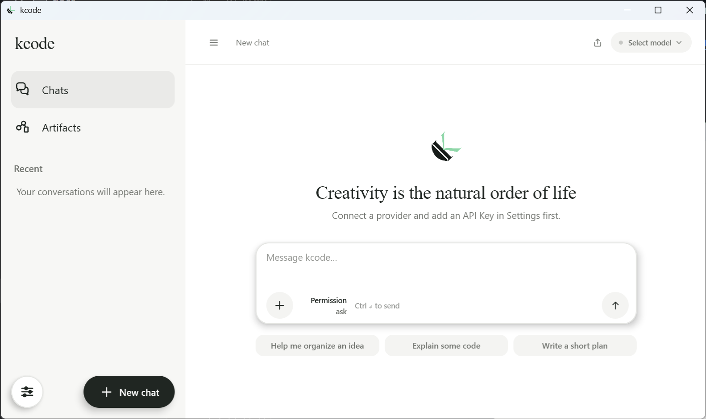
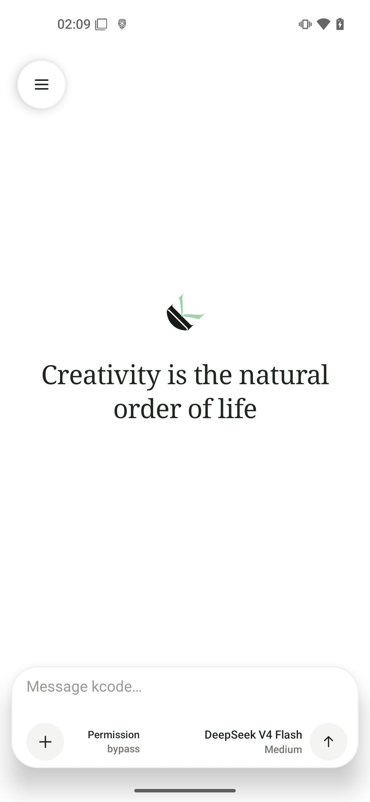

<div align="center">
  
  <h1>kcode</h1>
  <p><strong>A Kotlin-native, plugin-first AI Harness for Android and desktop.</strong></p>
  <p>Everything is a plugin. Native by design. Your models, tools, interface, and data.</p>

  <p>
    <strong>English</strong> · <a href="README.zh-CN.md">简体中文</a>
  </p>

  <p>
    
    
    
    <a href="LICENSE"></a>
  </p>
</div>

> [!IMPORTANT]
> kcode is evolving quickly. Expect breaking changes, verify important agent actions, and read the security model before enabling privileged tools.

## Meet kcode

kcode is the first open-source plugin-based AI Harness in the Kotlin Multiplatform ecosystem, with native applications for Android and desktop. Built with [Compose Multiplatform](https://www.jetbrains.com/compose-multiplatform/), [Koog](https://docs.koog.ai/), and Cordis, it combines a native interface, an extensible agent runtime, and local data storage.

**Everything is a plugin.** Compose the models, tools, prompts, permission policies, and UI you need. Replace the agent loop, swap a storage provider, or build a different root interface. Inspired by the DeepSeek Harness plugin model, kcode brings the same architecture to both platforms.

<table>
  <tr>
    <td align="center" width="76%">
      
      <br /><sub>Desktop</sub>
    </td>
    <td align="center" width="24%">
      
      <br /><sub>Android</sub>
    </td>
  </tr>
</table>

## Features

### Tools that get work done

- Stream Markdown responses with visible tool progress and saved conversation history.
- Search the Web through Google, Exa, or Bright Data, with source links.
- Read, list, write, and patch workspace files; read media on supported platforms.
- Run desktop shell commands or use Android's native shell and bundled Ubuntu 24.04 ARM64 environment.
- Stop or regenerate responses and export conversations as images.
- Continue generation in the Android background, with an optional floating conversation overlay.

### Goals and multi-agent work

Create a persistent objective with `/goal <objective>`. Goals survive app restarts, track status, elapsed time, and an optional token budget, and continue across turns. Pause, resume, edit, or clear them from the conversation.

When asked to delegate, the root agent can dispatch subtasks, exchange messages, and wait for results. The default composition supports five concurrent agents, including the root. Select a worker in the conversation to inspect its activity and output.

### Scheduled tasks

Ask for a one-shot or recurring task. Each run uses a separate conversation and presents a result you can keep in history or discard, with background notifications where supported. Recurring intervals start at one minute.

Tasks run while the application process is available. On restart, overdue tasks are recovered; recurring schedules skip missed intervals rather than launching a batch of catch-up runs.

### Skills

Add `SKILL.md` packages under `/workspace/.agents/skills` or `/workspace/.kcode/skills` to provide reusable instructions and workflows.

### Your choice of model

Built-in adapters cover OpenAI, Azure OpenAI, Anthropic, Google Gemini, DeepSeek, OpenRouter, Mistral AI, Alibaba DashScope / Qwen, Ollama, Zhipu GLM, and Amazon Bedrock (desktop).

Configure credentials, endpoints, and provider options in Settings; choose the model and temperature from the composer. Ollama supports local endpoints without an API key. Plugins can add model providers.

## Platform support

Android and desktop share chat, history, Goals, scheduling, multi-agent orchestration, Skills, file tools, Web search, and conversation image export. Platform differences are:

| Capability | Android | Desktop |
| --- | --- | --- |
| External plugins | APK/dex | JAR |
| Native shell | App UID / Shizuku / root | Workspace shell |
| Bundled Ubuntu 24.04 | ARM64, via PRoot | — |
| Native Web capability bridge | Supported device APIs | — |
| Background conversation overlay | Requires overlay permission | — |
| Amazon Bedrock adapter | — | Supported |

Availability depends on installed plugins, the selected model, and platform permissions. Real Shizuku authorization and root execution still need independent verification; see [verification](docs/verification.md).

## Get started

Download an Android APK, Windows MSI, macOS DMG, or Linux DEB from [GitHub Releases](https://github.com/meteor149/kcode/releases).

1. Open **Settings → Model provider**, select a service, and enter its credentials and connection options.
2. Return to the conversation and choose a model and temperature.
3. Ask for tool-backed work, create a Goal with `/goal <objective>`, or explicitly request parallel subtasks or scheduled work.

### Build from source

Use JDK 21 and the checked-in Gradle wrapper. JVM bytecode targets Java 17. Android builds require SDK 35; running the app requires an API 35+ device or emulator. On Windows, use `.\gradlew.bat` instead of `./gradlew`.

```bash
# Run desktop
./gradlew :apps:desktopApp:run

# Install Android debug build
./gradlew :apps:androidApp:installDebug
```

Desktop installers use `packageMsi`, `packageDmg`, and `packageDeb` under `:apps:desktopApp` on the corresponding operating system. The release workflow builds Android and desktop packages from tags.

### Android shell and Ubuntu

`execute_shell_command` runs Android's native shell. `execute_ubuntu_command` installs the bundled Ubuntu root filesystem on first use and runs it through PRoot. Ubuntu requires an ARM64 device and at least 384 MiB free in the runtime location.

Both tools follow the selected Shell mode:

- **App** uses the application UID and private workspace.
- **ADB** requires Shizuku started through adb, runs as UID 2000, and uses a separate runtime/workspace under `/data/local/tmp/ai.meteor.kcode/ubuntu`.
- **Root** requires a verified `su` grant and shares the app-mode runtime/workspace.

ADB mode's workspace is separate from the app's file tools. Root-created files may have ownership or permissions that App mode cannot later access. PRoot provides a Linux user space, not a VM or additional Android privileges. Installation, provenance, and limits are documented in [Android Ubuntu runtime](docs/android-ubuntu-runtime.md).

To configure model and search providers through adb, start kcode first and follow the [ADB settings guide](docs/adb-settings.md). A successful save returns `result=-1`; adb's exit code alone does not confirm saving.

## Plugin architecture

Native hosts provide platform primitives, `plugins/runtime` manages the Cordis tree, and `plugins/bundle-native` selects the default product composition. Only inventory and loading are pinned bootstrap components. Feature plugins declare service dependencies; consumers suspend when required providers disappear and rebind when they return.

| Module | Responsibility |
| --- | --- |
| `plugins/api` | Neutral domain, persistence, agent, lifecycle, and open UI contribution contracts |
| `plugins/default-ui-api` | Optional contracts for default layouts, pages, settings, and presenters |
| `libraries/ui` | Reusable Compose controls, design contracts, and vector icons |
| `plugins/runtime` | Composition, lifecycle ownership, and committed render snapshots |
| `plugins/bundle-native` | Default native product composition |
| `plugins/installation-store` | Installed packages and enable-state persistence |
| `apps/*`, `plugins/platform-*` | Application hosts, loaders, and platform adapters |

Product implementations live in feature modules: `ui-contributions` owns the neutral UI registry, `default-ui-bridge` owns its optional default registry and projection, and `application` coordinates the default root; `ui-profiles` supplies optional Profile management; `ui-pages`, `ui-messages`, `ui-shell`, and `ui-theme` provide conversation pages, message presentation, layout/settings, and theme respectively; feature packages own and withdraw their settings forms; repository, execution, model, search, and native capability providers own their services. Android and desktop share Room schemas and bundled SQLite. Module declarations are maintained in [settings.gradle.kts](settings.gradle.kts).

Settings schemas, validation and forms live with their features: permission settings in `interaction`, execution settings in `native-execution`, and model settings in `llm-core`. The `settings` module owns generic storage and command dispatch.

Web Search, Goal, Subagent, Localization, Markdown, and Conversation Export each include their related providers and contributions within one feature release. Their internal children remain independently reactive to available services.

Use the plugin manager to load, enable, disable, replace, or unload external packages. Finish or cancel active agent turns before changing composition. Installed state persists across restarts, and failed replacement or manifest publication restores the committed composition. Withdrawal cancels and waits for owned operations before releasing resources. Replacing storage does not automatically migrate data.

External packages share public SDK identities while loading product implementations and private dependencies separately. The current ABI is **Plugin API 70**; older packages must be rebuilt. Custom root renderers can choose their own services without adopting the default UI contracts.

Profiles support positioned insertion, ordering and movement between groups or the root. Cross-parent movement recreates instances in their new context; same-parent ordering retains resources. Invalid parents/cycles reject preparation, and failed publication or cancelled allocation restores the old hierarchy.

Shipped Bundle layers declare their module membership explicitly. ID prefixes do not select a layer, and additional available modules require explicit Profile selection.

Native factories start named Profiles from ordered bundle, Profile, machine and launch layers. The initial `native` Profile preserves existing settings and history locations; new Profiles default to separate data scopes. Desktop accepts `--profile <id>` and Android accepts the `profile` Activity intent extra. Successful generations freeze bundle definitions and verified package locks; restarting uses the commit rather than an edited draft. The plugin manager commits install, replacement, enable and removal commands through Profile transactions. Desktop and Android runtime switching use stable host facades with task admission and locked-generation failure recovery. Android App shell and Ubuntu bind scoped workspaces; scoped ADB execution is rejected before authorization. The SDK manager exposes revision-checked drafts, cloning, preview, history and explicit activation; historical restoration appends a new generation. Host-owned metadata and explicit activation remain available after failed restoration; unresolved owner cleanup blocks allocation until it succeeds. The optional ui-profiles package provides an initial settings management surface; rendered management acceptance and recovery UI remain pending. See the [Profile guide](docs/profiles.md) for current behavior and limits.

The runtime supports typed alternate modules through a managed Profile transaction, retaining instance configuration and scopes. Selected module IDs must be supplied again on restart; Desktop/Android factories accept lazy alternate-module catalogues, and the stable host selects them with active identity/generation checks. Plugins inject `KcodeProfiles` for catalogue/draft/history/module queries and host-owned activation, edit and module-selection commands. Accepted work survives the submitting plugin's withdrawal; observer cancellation does not cancel it. The management screen supports tree/Bundle draft forms, preview and activation; rendered management acceptance and independent recovery UI remain pending.

Read the [architecture guide](docs/plugin-architecture.md) and [plugin development guide](docs/plugin-development.md) for implementation rules. The [feature audit](docs/plugin-feature-audit.md) records current coverage; the [Harness specification](docs/deepseek-harness-plugin-spec.md) and [reserved API guide](docs/harness-reserved-api.md) distinguish implemented features from contracts that have no providers yet. All guides are indexed in [docs](docs/README.md).

The [cross-platform plugin package format](docs/plugin-package-format.md) uses platform and architecture variants. Native builds load default implementations from independently replaceable `.kplugin` archives, preserving configuration, disabled state, user replacements and uninstalls. Web Search, Goal, Schedule, Subagent, Localization, Markdown, and Conversation Export each own one feature release, including their related tools, commands, settings and optional presentation. Model adapters and reusable infrastructure keep independent releases. Cordis's Gradle packager builds independent JAR/APK artifacts directly from KMP source modules. `:stageBundledPlugins` consumes their package artifacts and exports the trusted catalog and archives; `settings.gradle.kts` and that catalog define current modules and platform variants. Hosts retain SDK contracts, composition/installation infrastructure and SDK-only input adapters. iOS is metadata only; runtime imports currently support desktop JAR and Android APK variants with SDK validation, dependency-set transactions and restart recovery.

Explicit interaction callbacks use SDK-only host input adapters. Production hosts exclude
the legacy interaction implementation module; the default settings policy runs from its package.

## Permissions and data

- **Tool policy:** `Deny`, `Ask`, and `Bypass` control tool approval. `Bypass` skips kcode's prompt, while operating-system permissions still apply. Scheduled runs use the model configured at execution time and the same permission policy as interactive work.
- **Files:** desktop paths stay inside the managed `/workspace`, with traversal and symlink escapes rejected. Android can also accept real absolute paths, subject to filesystem permissions. Skill resources are constrained to their managed package boundaries.
- **Credentials:** Android uses encrypted MMKV with a Keystore-protected key. Desktop settings are stored in the application data directory. The ADB receiver requires system `DUMP` permission and validates updates through settings commands; command arguments are visible to the trusted host during execution.
- **Android execution:** unavailable Shizuku/root access fails rather than silently switching identity. The background overlay requires “display over other apps” permission.

Report security-sensitive issues privately to the maintainers. Never commit credentials, `local.properties`, device captures, or generated databases.

## Build and test

```bash
# Multiplatform tests and both application hosts
./gradlew allTests :apps:desktopApp:compileKotlin :apps:androidApp:assembleDebug

# Focused SDK and default UI tests
./gradlew :plugins:api:allTests :plugins:default-ui-api:desktopTest

# Desktop composition and real external JAR loading
./gradlew :plugins:platform-desktop:test

# Android external APK/dex loading on an API 35+ device or emulator
./gradlew :plugins:platform-android:connectedDebugAndroidTest
```

`allTests` excludes connected device instrumentation. Device, Shizuku, and root checks have separate requirements in the [verification guide](docs/verification.md).

## Acknowledgements

Thanks to the maintainers and contributors of the projects that power kcode:

| Project | How it helps kcode |
| --- | --- |
| [Kotlin](https://github.com/JetBrains/kotlin), [kotlinx.coroutines](https://github.com/Kotlin/kotlinx.coroutines), and [kotlinx.serialization](https://github.com/Kotlin/kotlinx.serialization) | Provide the multiplatform language, structured concurrency, and serialization foundation. |
| [Compose Multiplatform](https://github.com/JetBrains/compose-multiplatform), [Material 3 / AndroidX](https://github.com/androidx/androidx), and [Haze](https://github.com/chrisbanes/haze) | Power the shared adaptive interface, design primitives, and visual effects. |
| [Koog](https://github.com/JetBrains/koog) and [Ktor](https://github.com/ktorio/ktor) | Form the agent, tool, model-provider, streaming, and networking foundation. |
| [Room](https://github.com/androidx/androidx/tree/androidx-main/room) and [SQLite](https://www.sqlite.org/) | Back local conversation persistence on Android and desktop. |
| [MMKV](https://github.com/Tencent/MMKV) and [Shizuku](https://github.com/RikkaApps/Shizuku) | Support mobile settings storage and explicit ADB-shell execution on Android. |
| [Operit](https://github.com/AAswordman/Operit), [OperitTerminalCore](https://github.com/AAswordman/OperitTerminalCore), [PRoot](https://github.com/proot-me/proot), [PRoot-Distro](https://github.com/termux/proot-distro), and [Ubuntu](https://ubuntu.com/) | Operit's runtime design and TerminalCore artifact chain informed the Android Ubuntu implementation. The packaged PRoot binaries, loader, and Ubuntu rootfs provenance are documented precisely in the [runtime guide](docs/android-ubuntu-runtime.md) and [NOTICE](NOTICE). |

Third-party licenses and attribution are recorded in [NOTICE](NOTICE) and the Gradle dependencies.

## Contributing

Contributions are welcome. Read [AGENTS.md](AGENTS.md) for repository structure, conventions, test commands, and pull-request expectations. Keep changes focused, test observable behavior, and include before/after media for UI work.

## License

Copyright 2026 The kcode Authors.

Licensed under [Apache License 2.0](LICENSE). Third-party components retain their own licenses. See [NOTICE](NOTICE) for attribution.

Permission configuration and composer controls belong to the interaction feature. Default chat pages expose generic settings editing and contribution slots; disabling the feature removes its controls and preserves saved configuration.

Settings persistence stores opaque feature namespaces and raw historical migration values.
Feature plugins own configuration schemas and defaults; v2 snapshots preserve unknown data
and no longer write feature-specific legacy scalars.

UI SDK modules contain shared service identities and presentation contracts. Their private registries
live in `ui-contributions` and `default-ui-bridge`; withdrawing a registry rejects retained service
calls and revokes its contributions. Default navigation presenters resolve page dependencies during
frame preparation, using the kernel's prepared UI/model/command snapshots. The smaller default UI
implementation modules retain the existing package IDs and independent enable states.

The `skills` module includes skill discovery/runtime and skill tools; `filesystem` includes
native filesystem/workspace implementations and file tools. Provider and consumer plugin
IDs and independent lifecycles are preserved within each source module.

Model vendors are independent Gradle modules below `plugins/llm` with their own clients,
catalogs, connection metadata and localization. `llm-core` owns common registry/configuration
and optional standard UI; settings and conversation choices use one committed catalog.
